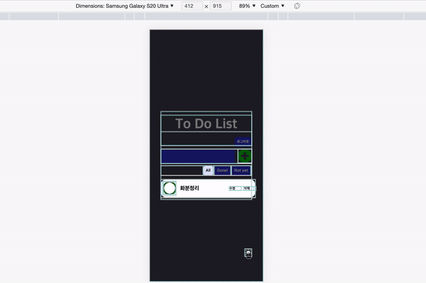
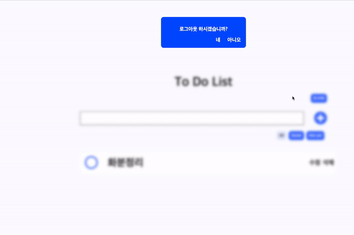
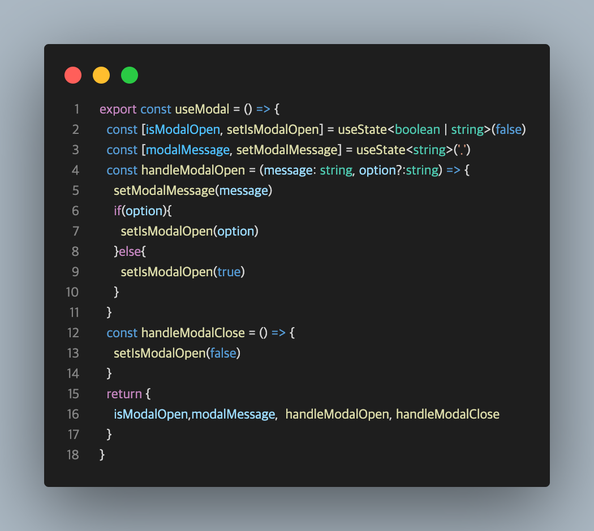
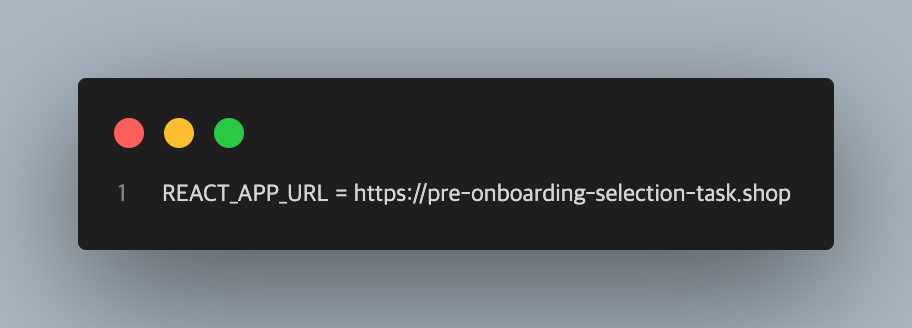

## **✨ 배포 링크**

### [배포 바로가기](https://to-do-list-delta-brown.vercel.app/)

### 로그인 이메일// 비밀번호

### `1234@1234.com` // `12341234`

## 📝 목차

- [📰 프로젝트 설명](#-프로젝트-설명)
- [🛠️ Dev Tools](#-dev-tools)
- [🖥 프로젝트 실행 방법](#-프로젝트-실행-방법)

## **📰 프로젝트 설명**
[회고](https://velog.io/@anotherhoon/%EA%B0%9C%EC%9D%B8-%ED%94%84%EB%A1%9C%EC%A0%9D%ED%8A%B8ToDoList-%ED%9A%8C%EA%B3%A0)

- React-Query과 TypeScipt를 이용한 To Do List
- Recoil을 이용하여 다크모드를 구현하였습니다.
- mobile first design strategy를 지향하며 반응형 웹 어플리케이션으로 제작하였습니다.
- custom hook을 적극 사용하여 코드 재활용에 힘썼습니다.
- alert사용을 지양하고 modal을 만들어 사용하였습니다. 


### **🏊 구현 예시**

**1) 반응형 및 다크모드**
<p align="center">
  <br>
  
  <br>
</p>

**2) 모달**
<p align="center">
  <br>
  
  <br>
</p>

**3) custom hook으로 모달 상태 관리**

<p align="center">
  <br>
  
  <br>
</p>


## **🛠 Dev Tools**

 
   
  
## **🖥 프로젝트 실행 방법**

### **1. root 경로에 .env 파일 생성 후 환경변수 설정**
<p align="center">
  <br>
  
  <br>
</p>

```
REACT_APP_URL = https://pre-onboarding-selection-task.shop
```

### **2. 아래 명령어로 의존성 패키지들을 설치합니다.**
```
$ npm install
```

### **3. 아래 명령어로 실행시킵니다.**

```
$ npm run start
```

## **📝 디렉토리 구조**

```
   📂src
   ┗ 📂page
   ┗ 📂api
   ┗ 📂components
   ┗ 📂container
   ┗ 📂recoil
   ┗ 📂hook
   ┗ 📂styles
   ┗ 📂type
   ┗ 📂utils
   ┗ 📂assets
   ┗📄app.tsx
   ┗📄index.tsx
   ┗📄Router.tsx
```


##  **🌱 commit message 규칙**

<details>
<summary>커밋 규칙</summary>
<div markdown="1">

⭐ feat : 새로운 기능에 대한 커밋

🎨 ui : 새로운 CSS관련 디자인에 대한 커밋

🛠 fix : 버그 수정에 대한 커밋

🧱 build : 빌드 관련 파일 수정에 대한 커밋

👏 chore : 파일 이동, 파일명 수정, 변수 제거 등의 자잘한 수정에 대한 커밋

⚒ refactor : 코드 리팩토링에 대한 커밋

📝 style : 공백 제거와 같은, 코드 스타일 혹은 포맷 등에 관한 커밋

✏ docs : 문서 수정에 대한 커밋

💡 ci : CI관련 설정 수정에 대한 커밋

</div>
</details>

## 📚 사용 Library

<details>
<summary>Lib List</summary>
<div markdown="1">

### production
- typescript
- react-query
- recoil
- styled-components
- axios
-  react-hook-form
- react-loader-spinner

</div>
</details>